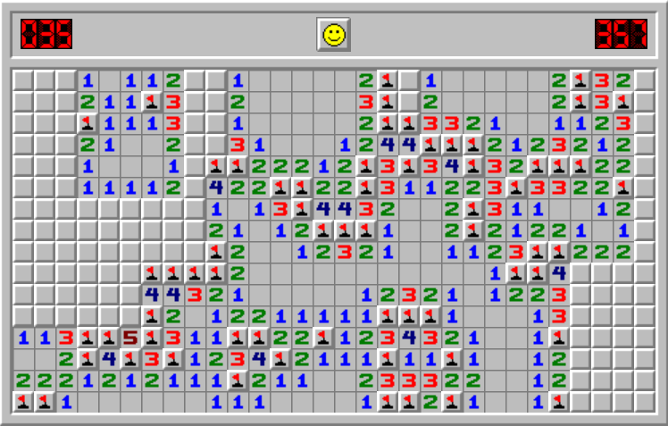

## Goals

* Flood fill use
* Flood fill algorithm
* Flood fill implementation

## Idea

Starting with node $n$ that has *target* color $c$, change color of all connected nodes of the same color to some *replacement* color $c'$ [1].

::: notes

[1] Usually called $c$-prime but we'll call it $c$-hyphen this week

:::

## Use

* Bucket fill tool
* Game board evaluation
* Enclosures counting
* Maze solving

### Bucket fill


### Game board evaluation



### Count enclosed areas

```text
·················***
··*···············**
·***················
··*·················
········***·········
·······*****········
········***·········
··················**
·················***
··················*·
```

## Algorithm

* Recursive or iterative
* Stack or queue
* 4-way or 8-way

### Stack-based recursive

1. If the current node (cell, pixel) color is equal to the *replacement* $c'$, return
2. If the current node color is **not** equal to *target*, return
3. Update color if the current node to $c'$
4. Continue the algorithm by expanding the flood to the adjacent nodes (NESW)
5. Return

### Queue-based iterative

1. If the current node (cell, pixel) color is equal to the *replacement* $c'$, return
2. If the current node color is **not** equal to *target*, return
3. Update color of the current node to $c'$
4. Create an empty queue $Q$
5. Add current node $n$ to $Q$
6. Continue while $Q$ is not empty
   1. Dequeue a node $n$ from $Q$
   2. If a neighbor of $n$ has the *target* color, paint that neighbor $c'$, and add it to the queue
7. Return

## Implementation

* Recursive
* Queue-based on constrained systems
* Rectangle painting
* Right-hand method

## Summary

* Flood fill use
* Flood fill algorithm
* Flood fill implementation

## Thank you

Got questions?

## References

* [Flood fill - Wikipedia](https://en.wikipedia.org/wiki/Flood_fill)
