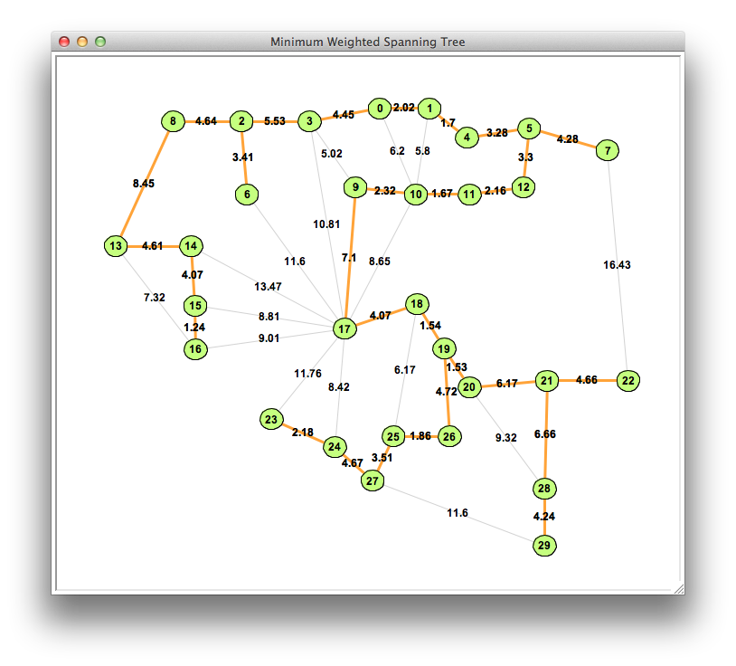

## Goals

* Problem
* Kruskal's algorithm
* Prim's algorithm

## Problem

Find **a** tree $T$ (or forest) that includes all vertices in a graph $G$, where the weight of edges $\sum{W_E}$ is minimal

Connecting cities, interesections etc.

### Northeast Iowa

### Northeast Iowa MST

## Kruskal's algorithm. General information

* Invented in 1956 by Joseph Kruskal
* Works well with any graph
* Greedy algorithm

## Kruskal's algorithm

1. Create a forest $F$, where each graph vertex $V$ is a separate tree
   * $F$ can be represented as a list of sets (initially, each `set` contains 1 vertex)
2. Add every graph edge $E$ to a collection $C$
3. Repeat the following steps while $C$ is not empty and $F$ is not complete (spanning)
    * remove the minimum weight edge $E_{min}$ from $C$
    * if $E_{min}$ connects two different trees (`sets`), add it to the forest $F$ and form a new `set` from the union of the previous two

### Challenges and solutions

* Sort vs heap
* Set vs Partition

### Partition

Later

## Prim's algorithm

Later

## Summary

* Problem
* Kruskal's algorithm
* Prim's algorithm

## Thank you

Got questions?

## References

* [Data Structures and Algorithms with Python by Kent Lee and Steve Hubbard](https://dl.acm.org/citation.cfm?id=2732680)
