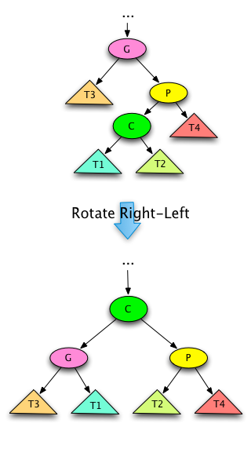
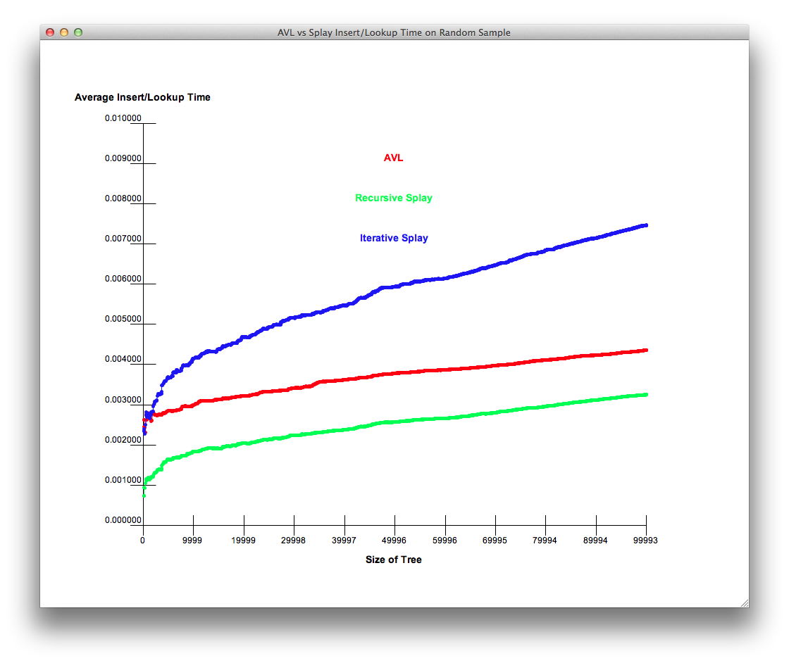

## Goals

* Properties
* Rotation
* Splaying
* Performance

## Properties

* Invented in 1985 by Daniel Sleator and Robert Tarjan
* Has (amortized) $O(\log{n})$ complexity for insertion, lookup, and removal
* Prioritizes recency of access (read or write)
* *Splay tree* maintains balance that is *good enough* without storing *balance* explicitely
* Relies on *spatial locality*
* Used to implement caching or garbage collectors

## Rotation

* *zig*, *zag*, *zig-zig*, and *zig-zag*

### Right-right

### Left-left

### Right-left

### Left-right

## Splaying

## Performance

## Summary

* Properties
* Rotation
* Splaying
* Performance

## Thank you

Got questions?

## References

* [Data Structures and Algorithms with Python by Kent Lee and Steve Hubbard](https://dl.acm.org/citation.cfm?id=2732680)
* [Splay tree - Wikipedia](https://en.wikipedia.org/wiki/Splay_tree)
